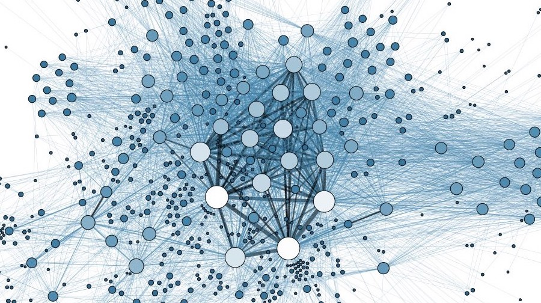
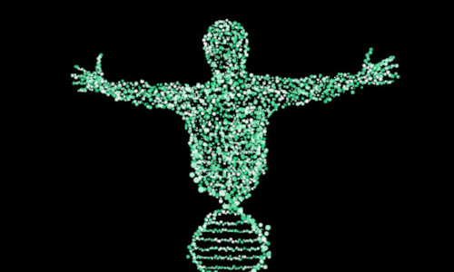

# {{page.title}}

Our internships are aimed at current PhD students looking for an industrial placement of around five months with the right to work in the UK.  The projects are focussed on innovation, in particular around getting the most value out of NHS data.

The projects often have a focus on emerging data science techniques and so we advertise mainly to data science programmes, however previous interns have come from other disciplines such as clinical, mathematics, computer science and bioinformatics, which have added huge value through the range of approaches and knowledge.

For details on **how to apply** see the <a href="/nhsx-internship-projects/overview.html">Scheme Overview</a> page 

For details on **open projects** see the <a href="/nhsx-internship-projects/projects.html">Projects</a> page
### Current Projects 
Currently our interns are working on the following projects in two waves.  These are the original briefs they applied to and their work and outputs will be available on our organisation GitHub.

|:---:|--|
|**Wave 7**|  July - December 2024 |
| &nbsp;  &nbsp;  | [Evaluating NER-focussed models and LLMs for identifying key entities in histopathology reports – working with GOSH DRIVE](https://nhsx.github.io/nhsx-internship-projects/eval-ner-histopathology-goshdrive/)|
| &nbsp;  &nbsp;  | [Investigating Privacy Concerns and Mitigations for Healthcare Language and Foundation Models](https://nhsx.github.io/nhsx-internship-projects/language-foundation-privacy-concern-mitigation/)|
| &nbsp;  &nbsp; |[Exploring Medical Visual Question Answering Approaches and Advancements](https://nhsx.github.io/nhsx-internship-projects/visual-question-answer/)|

|:---:|--|
| **Wave 6** | February - July 2024 |
| &nbsp; &nbsp; | [NHS Language Corpus Extension](https://nhsx.github.io/nhsx-internship-projects/nhs-language-corpus/)|
| &nbsp;  &nbsp;  | [Understanding Fairness and Explainability in Multi-modal Approaches within Healthcare](https://nhsx.github.io/nhsx-internship-projects/advances-modalities-explainability/)|

<ul class="nhsuk-grid-row nhsuk-card-group">
  <li class="nhsuk-grid-column-one-half nhsuk-card-group__item">
    

        
        

            <h2 class="nhsuk-card__heading nhsuk-heading-m">
            <a class="nhsuk-card__link" href="projects.html">Projects</a>
            </h2>
            
List of active and open projects to either get involved with or apply to in our next round

        

    

  </li>    
  <li class="nhsuk-grid-column-one-half nhsuk-card-group__item">  
    

        
        

            <h2 class="nhsuk-card__heading nhsuk-heading-m">
            <a class="nhsuk-card__link" href="overview.html">Scheme Overview</a>
            </h2>
            
Details of aims and application process of the scheme

        

    

  </li>
</ul>

Please get in contact by emailing <a href="mailto:datascience@nhs.net">our mailbox</a> with any further questions around the internship.  
